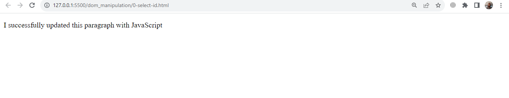
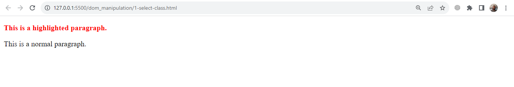
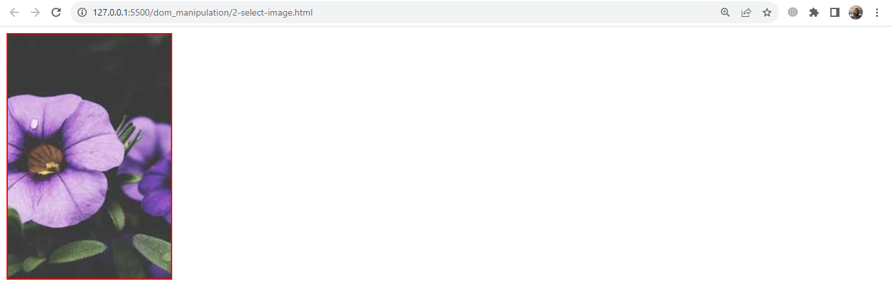
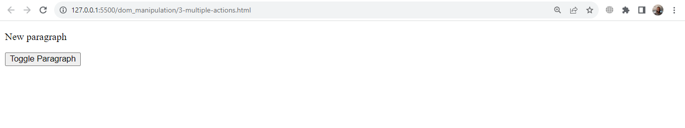

# dom_manipulation
-This is all about dom_manipulation ...
# 0. Play with the DOM

# 1. Selecting HTML Elements Using Selectors

# 2. Modifying Element Content, Attributes, and Styles

# 3. Creating, Appending, and Removing Elements

